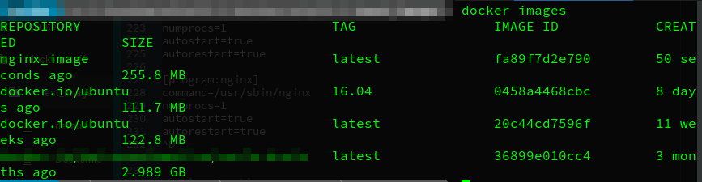
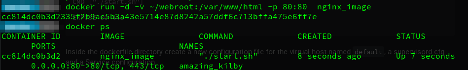
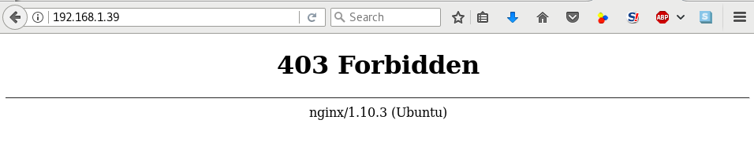

# Docker HowTo

The `Dockerfile` is a script which contains a collection of docker commands and
operating system commands. Below are the most common docker commands.

* `FROM`
  - TODO
* `MAINTAINER`
  - Optional, contains the name of the maintainer of the image.
* `RUN`
  - Used to execute a command during the build process of the docker image
* `ADD`
   - Copy from the host machine to the new docker image, also can be used to
   download from an specified URL.
* `ENV`
  - Define an environment variable.
* `CMD`
  - Used for executing commands when we build a new container from the docker
  image.
* `ENTRYPOINT`
  - Define the default command that will be executed when the container is
  running.
* `WORKDIR`
  - TODO
* `USER`
  - Set the user or UID for the container created with the image.
* `VOLUME`
  - Enables access/linked directory between the container and the host machine.


## Create a `Dockerfile`

First lets create a directory to contain the `Dockerfile`
```
mkdir ~/docker_imgs
cd ~/docker_imgs
gvim Dockerfile
```

In this example we will use Ubuntu 16.04 with Nginx and PHP-FPM.

Edit the dockerfile with:
```
# Comments are like in Makefiles
# download base image ubuntu
FROM ubuntu:16.04
```

Update the ubuntu software repositorz inside the dockerfile with the run commands

```
RUN apt-get update
```

Now lets install the needed applications:

```
RUN apt-get install -y nginx php7.0-fpm supervisor && \
        rm -rf /var/lib/apt/lists/*
```

At this stage, all the applications are in installed in the image, and we need
to configure them. We can replace the configuration files or edit the
configuration in the image.

```
# Define the docker environment variables
#Define the ENV variable
ENV nginx_vhost /etc/nginx/sites-available/default
ENV php_conf /etc/php/7.0/fpm/php.ini
ENV nginx_conf /etc/nginx/nginx.conf
ENV supervisor_conf /etc/supervisor/supervisord.conf

# Enable php-fpm on nginx virtualhost configuration
COPY default ${nginx_vhost}
RUN sed -i -e 's/;cgi.fix_pathinfo=1/cgi.fix_pathinfo=0/g' ${php_conf} && \
    echo "\ndaemon off;" >> ${nginx_conf}
```

In this example the `supervisord.conf` will be replaced with a file from local
machine.

```
COPY supervisord.conf ${supervisor_conf}
```

Now we can create the app directories and change the flags of the files
```docker
RUN mkdir -p /run/php && \
    chown -R www-data:www-data /var/www/html && \
    chown -R www-data:www-data /run/php
```

Next define the volume we can mount the directories listed in the host machine.
```docker
VOLUME ["/etc/nginx/sites-enabled", "/etc/nginx/certs", "/etc/nginx/conf.d", "/var/log/nginx", "/var/www/html"]
```

Finallz, setup the defaul command `CMD` and the open port for HTTP and HTTPS.
And we will create a `start.sh` file for default `CMD` when the container is
starting. The file contains supervisord command and we will copy the file to the
new image with `COPY` dockerfile command.

```docker
# configure services and port
COPY start.sh /start.sh
CMD ["./start.sh"]

EXPOSE 80 443
```
The complete Dockerfile:

```docker
#Download base image ubuntu 16.04
FROM ubuntu:16.04

# Update Software repository
RUN apt-get update

# Install nginx, php-fpm and supervisord from ubuntu repository
RUN apt-get install -y nginx php7.0-fpm supervisor && \
    rm -rf /var/lib/apt/lists/*

#Define the ENV variable
ENV nginx_vhost /etc/nginx/sites-available/default
ENV php_conf /etc/php/7.0/fpm/php.ini
ENV nginx_conf /etc/nginx/nginx.conf
ENV supervisor_conf /etc/supervisor/supervisord.conf

# Enable php-fpm on nginx virtualhost configuration
COPY default ${nginx_vhost}
RUN sed -i -e 's/;cgi.fix_pathinfo=1/cgi.fix_pathinfo=0/g' ${php_conf} && \
    echo "\ndaemon off;" >> ${nginx_conf}

#Copy supervisor configuration
COPY supervisord.conf ${supervisor_conf}

RUN mkdir -p /run/php && \
    chown -R www-data:www-data /var/www/html && \
    chown -R www-data:www-data /run/php

# Volume configuration
VOLUME ["/etc/nginx/sites-enabled", "/etc/nginx/certs", "/etc/nginx/conf.d", "/var/log/nginx", "/var/www/html"]

# Configure Services and Port
COPY start.sh /start.sh
CMD ["./start.sh"]

EXPOSE 80 443
```


Inside the dockerfile directory create a new configuration file for the virtual
host named `default`, a supervisord cfg and a Service configuration.

```
$cat > default
server {
    listen 80 default_server;
    listen [::]:80 default_server;

    root /var/www/html;
    index index.html index.htm index.nginx-debian.html;

    server_name _;

    location / {
        try_files $uri $uri/ =404;
    }

    location ~ \.php$ {
        include snippets/fastcgi-php.conf;
        fastcgi_pass unix:/run/php/php7.0-fpm.sock;
    }

    # deny access to .htaccess files, if Apache's document root
    # concurs with nginx's one
    #
    #location ~ /\.ht {
    #    deny all;
    #}
}^D
```

And for the `supervisord.conf`:
```
$cat > supervisord.conf
[unix_http_server]
file=/dev/shm/supervisor.sock   ; (the path to the socket file)

[supervisord]
logfile=/var/log/supervisord.log ; (main log file;default $CWD/supervisord.log)
logfile_maxbytes=50MB        ; (max main logfile bytes b4 rotation;default 50MB)
logfile_backups=10           ; (num of main logfile rotation backups;default 10)
loglevel=info                ; (log level;default info; others: debug,warn,trace)
pidfile=/tmp/supervisord.pid ; (supervisord pidfile;default supervisord.pid)
nodaemon=false               ; (start in foreground if true;default false)
minfds=1024                  ; (min. avail startup file descriptors;default 1024)
minprocs=200                 ; (min. avail process descriptors;default 200)
user=root             ;

; the below section must remain in the config file for RPC
; (supervisorctl/web interface) to work, additional interfaces may be
; added by defining them in separate rpcinterface: sections
[rpcinterface:supervisor]
supervisor.rpcinterface_factory = supervisor.rpcinterface:make_main_rpcinterface

[supervisorctl]
serverurl=unix:///dev/shm/supervisor.sock ; use a unix:// URL  for a unix socket

; The [include] section can just contain the "files" setting.  This
; setting can list multiple files (separated by whitespace or
; newlines).  It can also contain wildcards.  The filenames are
; interpreted as relative to this file.  Included files *cannot*
; include files themselves.

[include]
files = /etc/supervisor/conf.d/*.conf


[program:php-fpm7.0]
command=/usr/sbin/php-fpm7.0 -F
numprocs=1
autostart=true
autorestart=true

[program:nginx]
command=/usr/sbin/nginx
numprocs=1
autostart=true
autorestart=true
^D
```

The `start.sh`

```
$cat > start.sh
#!/bin/sh

/usr/bin/supervisord -n -c /etc/supervisor/supervisord.conf
```
Change the flags for `start.sh`

```
chmod +x start.sh
```


## Build the docker image and create a container based on it.

The docker and all required config files are created, now start the build of the
docker image.

```
docker build -t nginx_image . # check out the dot
```

When the command is completed, check the result with the next command:
```
docker images
```
Our image `nginx_image` should be listed there.


<p style="text-aling:center"></p>

Now we can try to create a new container based on `nginx_image`. Before create
new container, we can create a new directory on the host machine for webroot data
```
cd
mkdir -p /webroot
```

Now run the new container:
```
docker run -d -v /webroot:/var/www/html -p 80:80  nginx_image
```

Then we ca ncheck that the new container with name hakase based on `nginx_image`
is running.

```
docker ps
```

<p style="text-aling:center"></p>


## Now lets test our configuration for the php and friends.

Create a `index.html` file in `/webroot`:
```
echo '<h1>Nginx and PHP-FPM 7 inside Docker Container</h1>' > /webroot/index.html
```

Testing with curl command accessing the host machine ip address:
```
curl 192.168.1.250
curl -I 192.168.1.250
```

Next test that the PHP is runnig creating a `phpinfo` file in the `/webroot`
in the host machine.

```
echo '<?php phpinfo(); ?>' > /webroot/info.php
```
Now open a web browser and type the hostip and info.phpinfo


example:
```
http://192.168.1.100/info.php
```

Almost working:

<p style="text:center"></p>


## Stop the docker instance

First lets find out the name of the container:
```
docker ps
CONTAINER ID        IMAGE               COMMAND             CREATED             STATUS              PORTS                         NAMES
cc814dc0b3d2        nginx_image         "./start.sh"        9 minutes ago       Up 9 minutes        0.0.0.0:80->80/tcp, 443/tcp   amazing_kilby

```

In our case the container is named `amazing_kilby`, lets stop it.

```
docker stop amazing_kilby
amazing_kilby
```

### Test samples:

Run a Docker instance named ubuntu and add the windows workspace under `/src` dir.
```
docker run --name ubuntu -e HOST_IP=192.168.1.166 -v //%HOMEPATH%/workspace/:/src  -t -i ubuntu /bin/bash
```
